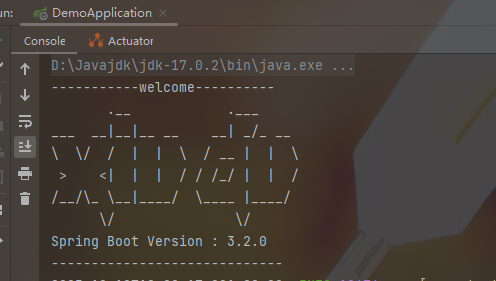
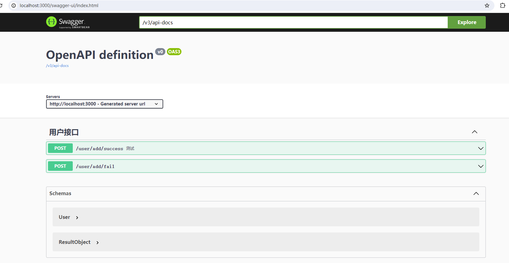

**用于记录学习 `SpringBoot` 的笔记** 

### 修改Banner

在`.properties`文件中添加配置

```properties
# 定义 Springboot Banner
spring.banner.charset=UTF-8
spring.banner.location= classpath:static/banner.txt
```

然后在 `static/banner.txt`中自定义内容

```
-----------welcome----------
       .__            .___
___  __|__|__ __    __| _/_ __
\  \/  /  |  |  \  / __ |  |  \
 >    <|  |  |  / / /_/ |  |  /
/__/\_ \__|____/  \____ |____/
      \/               \/
Spring Boot Version : ${spring-boot.version}
-----------------------------
```

然后启动 `springboot` 就会更改原图标内容



***

### 添加日志

在 `.properties` 文件中添加配置

```properties
# 定义日志 (需要配置 config/aspect/LogAspect 文件)
logging.level.root=info
logging.level.com.xiu=debug
logging.file.path=log/blog-dev.log
```

然后在指定路径配置日志文件

***

### 跨域问题

前后端分离时，请求地址的域名或端口和当前访问的域名或端口不一样会产生跨域问题

为解决其问题，需要在config下加入两个配置类

`CorsConfig`

```java
import org.springframework.context.annotation.Configuration;

import javax.servlet.*;
import javax.servlet.http.HttpServletRequest;
import javax.servlet.http.HttpServletResponse;
import java.io.IOException;

/**
 * 解决前后端跨域问题
 */
@Configuration
public class CorsConfig implements Filter {
    @Override
    public void doFilter(ServletRequest req, ServletResponse res, FilterChain chain) throws IOException, ServletException {
        HttpServletResponse response = (HttpServletResponse) res;
        HttpServletRequest request = (HttpServletRequest) req;

        String origin = request.getHeader("Origin");
        if(origin!=null) {
            response.setHeader("Access-Control-Allow-Origin", origin);
        }

        String headers = request.getHeader("Access-Control-Request-Headers");
        if(headers!=null) {
            response.setHeader("Access-Control-Allow-Headers", headers);
            response.setHeader("Access-Control-Expose-Headers", headers);
        }

        response.setHeader("Access-Control-Allow-Methods", "*");
        response.setHeader("Access-Control-Max-Age", "3600");
        response.setHeader("Access-Control-Allow-Credentials", "true");

        chain.doFilter(request, response);
    }

    @Override
    public void init(FilterConfig filterConfig) {
    }
    
    @Override
    public void destroy() {
    }
}
```

`CorsMapping`

```java
import org.springframework.context.annotation.Configuration;
import org.springframework.web.servlet.config.annotation.CorsRegistry;
import org.springframework.web.servlet.config.annotation.WebMvcConfigurer;

/**
 * @author: 锈渎
 * @date: 2023/12/9 20:56
 * @code: 面向对象面向君， 不负代码不负卿。
 * @description: 全局配置前后端跨域问题
 */

@Configuration
public class CorsMapping implements WebMvcConfigurer {

    @Override
    /**
     * 重新跨域支持方法
     * CorsRegistry
     */
    public void addCorsMappings(CorsRegistry registry) {
        // addMapping 添加可跨域的请求地址
        registry.addMapping("/**")
                // 设置跨域 域名权限 规定由某一个指定的域名 + 端口能访问跨域项目
                .allowedOrigins("*")
                // 是否开启 cookie 跨域
                .allowCredentials(false)
                // 规定能够跨域访问的方法类型
                .allowedMethods("GET", "POST", "DELETE", "PUT", "OPTIONS")
                // 添加验证头信息 token
                // .allowedHeaders()
                // 预检请求存活时间 在此期间不再次发送预检请求
                .maxAge(3600);
    }
}

```


### 接口

> 待学：参数校验，多个版本接口，接口幂，接口前面，接口限流等。

#### 统一接口封装

将返回值封装成一个类，形成如下格式

```json
	"timestamp": 1702210386665, // 响应时间戳
    "status": 200, // 状态码
    "error": "success", // 报错信息
    "data": { // 数据
        "userId": 1,
        "age": 20,
        "nickName": "111",
        "email": "XXXXXX@qq.com",
        "cardNo": "12345",
        "sex": 2
    }
```


```java
import lombok.AllArgsConstructor;
import lombok.Data;
import lombok.NoArgsConstructor;

/**
 * @author: 锈渎
 * @date: 2023/12/10 15:29
 * @code: 面向对象面向君， 不负代码不负卿。
 * @description: 封装统一接口返回值
 */
@Data
@NoArgsConstructor
@AllArgsConstructor
public class Result<T> {
    private long timestamp; // 响应时间(当前毫秒数)
    private Integer status; // 返回状态码
    private String error; // 返回错误信息
    private Object data; // 返回数据类型

    public static Result<?> success() {
        return new Result<>(System.currentTimeMillis(), 200, "success", null);
    }

    public static Result<?> success(Object data) {
        return new Result<>(System.currentTimeMillis(),200, "success", data);
    }

    public static Result<?> error(String message) {
        return new Result<>(System.currentTimeMillis(),500, message, null);
    }

    public static Result<?> error(Integer code, String message) {
        return new Result<>(System.currentTimeMillis(),code, message, null);
    }

    public static Result<?> error() {
        return new Result<>(System.currentTimeMillis(),500, "fail", null);
    }

}

```

#### 集成swagger接口文档

在 `pom.xml` 添加依赖, 然后就可以直接用 `swagger3` 的注解了

```xml
   <dependency>
      <groupId>org.springdoc</groupId>
      <artifactId>springdoc-openapi-starter-webmvc-ui</artifactId>
      <version>2.0.2</version>
   </dependency> 
 
     <dependency>
      <groupId>org.springdoc</groupId>
      <artifactId>springdoc-openapi-starter-webmvc-api</artifactId>
      <version>2.0.2</version>
   </dependency>
```

然后访问地址  [http://ip:port/swagger-ui/index.html]() 就能访问接口文档了

 


***

### 统一异常处理

如果不统一进行异常处理，那么在 `Controller` 层会充斥着大量的 `tyr{...} catch {...} finally{...}`等冗余代码块，影响代码的可读性

1. 首先编写自定义异常类(继承于`RuntimeException`)

​	`CustomException` 

```java
import lombok.Getter;

/**
 * @author: 锈渎
 * @date: 2023/12/10 18:32
 * @code: 面向对象面向君， 不负代码不负卿。
 * @description: 自定义错误
 */

@Getter
public class CustomException extends RuntimeException{
    private Integer code;
    public CustomException(Integer code, String message) {
        super(message);
        this.code = code;
    }

    public CustomException(String message) {
        super(message);
    }
}

```

2. 编写错误拦截器

   `ControllerExceptionHandler`

   ```java
   import com.xiudu.demo.config.api.Result;
   import lombok.extern.slf4j.Slf4j;
   import org.springframework.web.bind.annotation.ControllerAdvice;
   import org.springframework.web.bind.annotation.ExceptionHandler;
   import org.springframework.web.bind.annotation.ResponseBody;
   
   /**
    * @author: 锈渎
    * @date: 2023/6/24 0:46
    * @code: 面向对象面向君， 不负代码不负卿。
    * @description: 自定义错误拦截器, 同一处理页面错误判断
    */
   
   @ControllerAdvice // 拦截所有标注有Controller注解的错误
   @Slf4j
   public class ControllerExceptionHandler {
   
       //定义这是一个异常处理类方法Exception异常都会经过该方法
       @ExceptionHandler(Exception.class)
       @ResponseBody
       public Result<?> exceptionHandel(Exception e) throws Exception {
           //错误信息打印成日志
           log.error("Exception : ",e);
           if(e instanceof CustomException exception) { // 返回自定义错误;
               return Result.error(exception.getCode(), exception.getMessage());
           }else if(e instanceof RuntimeException){ // 返回 400;
               return Result.error("Runtime Error");
           }else  return Result.error("系统错误"); // 返回其他系统错误
       }
   
   }
   ```

   